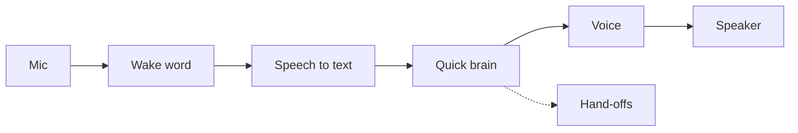
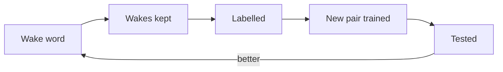
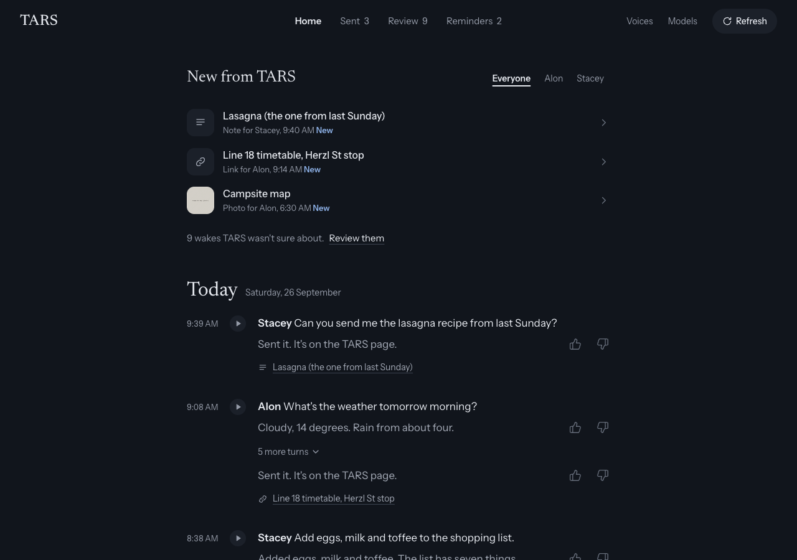

# TARS

[](https://github.com/alon-pilosoph/tars/actions/workflows/ci.yml)

A household voice assistant you can take apart: say "hey TARS", ask something, and it answers in TARS's voice.
It runs on a Raspberry Pi 5 with a USB speakerphone, or on a Mac while you work on it.

**[See how it works, from wake word to answer →](https://tars.alonp.dev)**

## At a glance

| Part | Result |
|---|---|
| [Wake word](docs/wake-word.md) | Two stages, on the device: 97% of held-out voices in quiet, 97% of the owner's (never heard), 1 false answer in an hour of TV |
| [Response time](docs/latency.md) | 1.3-1.4 s from you stopping to the first sound, down from about 3.5 s |
| [Quick model](docs/models.md) | Qwen on Groq, then Cerebras, hedged at 0.5 s; 149/156 on the capability benchmark at low reasoning |
| [Self-learning](docs/self-learning.md) | Retrains its wake models from the household's use, installs them only if better |
| [Runs on](docs/deployment.md) | Raspberry Pi 5 with a USB speakerphone (an Anker PowerConf here), or a Mac |

## Highlights

- **Nothing leaves the house before the wake word's double-check agrees** ([wake word](docs/wake-word.md)).
- **Answers are drafted before you finish**, and thrown away if you keep talking ([response time](docs/latency.md)).
- **A quick model that hands off**: web questions to OpenAI, hard ones to a thinking model ([models](docs/models.md)).
- **Reminders, timers and messages** that repeat until someone says "got it" ([reminders](docs/reminders.md)).
- **Knows who's talking**, locally and in parallel, so it adds no latency ([self-learning](docs/self-learning.md)).
- **Every paid service is optional** ([what runs instead](docs/architecture.md#running-on-the-keys-there-are)).
- **A household web UI**: conversations, what TARS sent, wakes to review, reminders, voices ([web UI](docs/web-ui.md)).

How a request is answered:



The wake word runs on the device. Speech to text and the voice are Deepgram (Flux and Aura-2), the quick brain is Qwen
on Groq or Cerebras, and hand-offs go to OpenAI for web search and hard questions.

How it learns:





## Quick start

Needs [uv](https://docs.astral.sh/uv/). On Linux (a Pi included), first `sudo apt install libportaudio2 libatomic1`.

```bash
git clone https://github.com/alon-pilosoph/tars.git && cd tars
uv sync --all-extras                   # echo cancellation and Claude are extras
cp .env.example .env                   # then add your API keys: OpenAI, Deepgram, Groq, Cerebras, or some of them
uv run voice-assistant --check         # keys, devices, models, services, the voice and the mic: what's wrong, and what to do
uv run voice-assistant --mic-test      # loudness, speech and wake-word meters; no API key needed
uv run voice-assistant                 # say "hey TARS", then ask something
uv run voice-assistant --web           # in a second terminal: the web UI at http://127.0.0.1:8080
```

Also `--ptt` (press Enter instead of the wake word), `--text` (type, hear answers) and `--list-devices`. On a Pi,
`deploy/install-pi.sh` does it all ([at home](docs/deployment.md)). The web UI has no accounts: keep it on your network.

## Configure

Everything is in [`config.toml`](config.toml): audio devices by name, wake sensitivity, turn-taking, each stage's model.
Every key in `.env` is optional, as long as something can hear, think and speak; TARS says at startup what it does
without the missing ones ([running on the keys there are](docs/architecture.md#running-on-the-keys-there-are)).

The persona is TARS from *Interstellar*; for a plain assistant, set `[tts] effect = ""` and edit the system prompt.

## Docs

| Doc | What's in it |
|---|---|
| [Hearing "hey TARS"](docs/wake-word.md) | the two-stage wake word, its training and evaluation |
| [Training the models](training/README.md) | the training pipeline, from public data to the household's pair |
| [Response time](docs/latency.md) | where the time goes, and the steps from 3.5 s |
| [Choosing the quick model](docs/models.md) | the capability benchmark, every model tried, routers |
| [How TARS fits together](docs/architecture.md) | the pipeline, failures, missing keys, privacy, the code map |
| [Self-learning TARS](docs/self-learning.md) | what's kept, automatic labels, voices, retraining |
| [Reminders, timers and messages](docs/reminders.md) | setting, saying and acknowledging them |
| [The web UI](docs/web-ui.md) | pages, the Refresh rule, the API, checks |
| [Running TARS at home](docs/deployment.md) | the Pi, services, enrolling voices, backup, a test run |
| [What's next](docs/roadmap.md) | real use, interrupting, the hard-question hand-off, memory |

## Development

```bash
uv run pytest                                # offline tests: no devices or API keys
uv run ruff check src tests tools training && uv run ruff format src tests tools training
cd webui && npm install
npm test && npm run lint && npm run format   # the web UI's unit tests, lint and formatting
npm run build                                # rebuilds the committed page in src/voice_assistant/webui_static/
npm run e2e && npm run visual                # against a real backend, and the screenshot baselines (macOS)
npm run site                                 # the How TARS works page, from site/ into site/dist/
```

CI runs the tests, lint and format checks, a check that the committed web build is current, and an end-to-end run.

## License

The code is MIT (`LICENSE`). The "hey TARS" models in `models/generic/` are CC BY-NC-SA 4.0 (`models/LICENSE.md`),
since some of their training data is non-commercial only; every source and its terms are in `ATTRIBUTION.md`.
