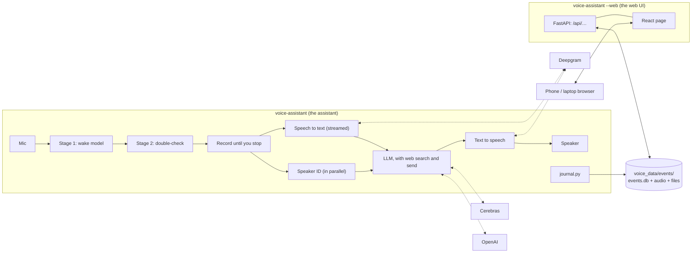

# How TARS fits together

Two processes on one machine (a Mac while developing, a Raspberry Pi 5 at home), sharing one folder of data.

## The assistant

One mic stream, read in 80 ms blocks from one queue, so nothing fights over the audio device. On each block:

1. **Stage 1** (microWakeWord, local) scores the block. Close calls are logged as near-misses.
2. **Stage 2** (Vosk with a grammar plus a learned layer, local) decides: answer, ask "Did you call me?", or ignore.
   See [hearing "hey TARS"](wake-word.md).
3. **Recording** runs until you've finished. [Silero VAD](https://github.com/snakers4/silero-vad) (local, 2 MB)
   hears you start; Deepgram's [Flux](https://deepgram.com/learn/introducing-flux-conversational-speech-recognition)
   decides when you're done, from your words as well as the pause. If Flux fails, the local rules take over: after
   `end_silence_s` (0.8 s) of silence, [Smart Turn](https://github.com/pipecat-ai/smart-turn) (local, 8 MB) may keep
   waiting up to `max_pause_s` (1.6 s). A bare "hey TARS" followed by a pause gets "Yes, Alon?" (speaker ID from the
   wake alone) and waits.
4. **Speech to text** is Flux too, streamed while you talk, so the words come with its decision; if the stream
   fails, OpenAI transcribes the same recording. **Speaker ID** (WeSpeaker ResNet34 on ONNX,
   local) runs at the same time, so knowing who's talking adds no latency. The request reaches the LLM tagged
   `[Speaker: Alon]`.
5. **The LLM** answers in TARS's voice, streamed: Qwen on Cerebras first (about 0.3 s to its first sentence). When
   the answer needs the web or the TARS page it replies `<look-up>`, and that turn goes to OpenAI's model (the
   Responses API, with web search and the send tool), which also answers whenever Cerebras fails, and for two
   minutes after, so an outage doesn't cost every turn Cerebras's timeout; both share one conversation. Each finished sentence goes to **text to speech** (Deepgram's Aura-2 Zeus voice, or OpenAI's
   Onyx) straight away, and playback starts on the first audio chunk, so TARS starts talking while the reply is
   still being written. The TARS effect (a speaker in a metal box) is applied as it streams. All of this starts
   early, when Flux thinks you may be done, while the recording goes on: if you carry on talking the draft is thrown
   away, and it's only played, logged and allowed to send anything once your turn is confirmed over (see
   [response time](latency.md)).
6. **Follow-ups:** after answering, it listens a few more seconds without the wake word. The LLM answers `<skip>`
   when what it overheard wasn't meant for it, and TARS stays quiet and forgets it. The conversation is sent to the
   LLM until it's been quiet for `memory_minutes`.

Every stage sits behind a small interface (`Trigger`, `Transcriber`, `Brain`, `Voice`), so a local model is one
new class and a config change. Latency is printed for every turn, by stage, and `tools/latency_bench.py` measures it
end to end. When TARS wakes, it connects to Cerebras, OpenAI and Deepgram's voice while you're still talking. A
failed request gets a
spoken line ("That didn't work. Not my finest moment. Try again.", plainer below 50% humor), made at startup so it
plays even when the voice service is what failed; the voice gives up after 4 s without audio. A microphone that
stops delivering audio exits so systemd restarts it.

### The LLM's tools

- **Web search** (OpenAI's built-in tool, `[llm] web_search`): for current questions and real links. When the
  model starts a search, TARS says "Looking it up." so the wait isn't silent.
- **Send** (`[llm] send`, needs `[learning] log_events`): a strict function tool for a link, a note (short
  markdown), a list, or a text file (`.txt`, `.md`, `.csv`, `.ics`), for whoever asked or for the household. The
  assistant checks every call (links must be http(s), a file needs a known type and its text) and returns errors to
  the model, which gets up to three rounds; the last round can't call tools, so TARS always says something. Sent
  things appear in the web UI; TARS says "It's on the TARS page." It never reads a link aloud. Something sent "for
  whoever asked" goes to the household when speaker ID didn't know who asked.

Requests to OpenAI use `store=False`. The send tool is off in `--text` mode and when logging is off, since there'd
be nowhere to put what it sends.

## What it keeps, and where

Everything the assistant writes goes to `voice_data/events/` (gitignored) through `journal.py`, whose writes can
fail without costing a reply. The layout, retention and labeling rules are in [self-learning](self-learning.md).
Voiceprints live in `voice_data/voiceprints.npz`; the personal wake models in `models/personal/` (gitignored).
The short lines made ahead ("Yes?", "Did you call me?", the error lines) are kept in `voice_data/phrases/`, one
folder per `[tts]` setup, so TARS can still say something went wrong after a restart with the network down. After
changing the voice effect's code (`effects.py`), delete that folder so the lines are made again.

## What leaves the machine

- **Before the wake is confirmed, nothing.** Stage 1, stage 2, the speech detector and the end-of-turn model run
  locally.
- **After it,** three services each get part of the turn (with the default `config.toml`):
  - **Deepgram** gets your request's audio, streamed for speech to text from when you start speaking after a wake,
    and TARS's reply text, to speak it.
  - **Cerebras** gets the conversation so far (its text, with each request's `[Speaker: name]` tag and TARS's
    replies) and answers first.
  - **OpenAI** gets the same conversation for the turns Cerebras hands over (anything that needs the web or the
    TARS page) or can't answer, and runs those turns' web searches. It also transcribes a request's recording when
    Deepgram's stream fails. With `[stt]` or `[tts] provider = "openai"`, it gets the audio or the reply text instead
    of Deepgram.
- **Never:** the event log, the audio kept for learning, voiceprints, and anything the web UI shows. The web UI is
  served from the same machine and talks to nothing else.

## The web UI

`voice-assistant --web` is a separate process: a FastAPI server (`webui.py`) over the same database, serving the
React page built from `webui/` (committed as `src/voice_assistant/webui_static/`, so the Pi needs no Node). The
assistant writes and the web UI reads and edits: SQLite in WAL mode lets both work at once, and every change of more
than one row is one transaction. Each runs as its own service, so a crash in one never takes the other down. The web
UI is described in [the web UI](web-ui.md).

**It has no accounts**, so it's meant for the home network, and it protects itself against the two ways a web page
elsewhere could reach it through someone's browser:

- **Host allow-list:** it only answers requests addressed to an IP address, `localhost`, `*.local`, `*.ts.net`, a
  single-label name (`tars`, the Pi's hostname) or a name in `[web] allowed_hosts`. Anything else gets 421, which
  stops DNS-rebinding attacks.
- **Same-origin changes:** a request that changes something (POST, DELETE) must come from the TARS page itself (or
  from `localhost`); anything else gets 403.

To use it away from home, put the Pi and the phone on Tailscale rather than forwarding a port.

## Code map

The assistant is `src/voice_assistant/`:

| Area | Files |
|---|---|
| Audio in and out | `audio.py` (mic stream, devices by name, playback), `effects.py` (the TARS speaker box), `mic_test.py` (the `--mic-test` meter) |
| Hearing "hey TARS" | `wake.py` (stage 1, push-to-talk), `verify.py` (stage 2), `versions.py` (trained pairs, which is in use, switching live) |
| Hearing when you're done | `stt.py` (Flux), `recorder.py`, `vad.py` (Silero), `turn.py` (Smart Turn, the fallback) |
| Understanding and answering | `stt.py` (Deepgram, OpenAI as backup), `llm.py` (Cerebras, OpenAI with its tools), `speech.py` (sentence pipelining), `tts.py`, `draft.py` (start early, speak late) |
| Reminders | `reminders.py` (the table, what's due, what to say, the brain's tools), and in `assistant.py` saying them and hearing "got it" |
| Who's talking | `speaker.py` (voiceprints), `clustering.py` (grouping voices), `enroll.py` (recording people) |
| The main loop | `assistant.py` (wake, listen, answer, follow-ups, errors, timing), `__main__.py` (wiring, command line), `config.py` (`config.toml`, the keys it needs) |
| What's kept | `store.py` (database, audio, upgrades), `events.py` (wakes and labels), `conversations.py` (turns and sent things), `journal.py` (writes that never cost a reply), `files.py` (crash-safe writes) |
| Downloads | `models.py` (the small local models, on first use) |
| The web UI | `webui.py` (server and API), `webui/` (the React page), `tools/webui_demo.py` (demo data) |

Around it: `training/` (the scripts that made the wake models, [training/README.md](../training/README.md)),
`tools/` (benchmarks: `latency_bench.py`, `turn_bench.py`, `wakeword_bench.py`, `verifier_bench.py`), `deploy/`
(the Pi's install script and services) and `tests/`.
