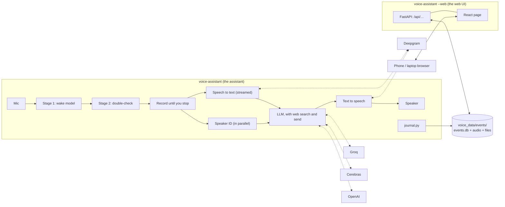

# How TARS fits together

TARS is two processes on one machine (a Mac while developing, a Raspberry Pi 5 at home) sharing one folder of data:
the assistant, which listens and answers, and the web UI, which shows and edits what the assistant kept. Five
principles shape the design:

- **Local until it's sure.** The wake word, the double-check, the speech detector and speaker ID run on the machine.
  Nothing leaves it before a wake is confirmed ([what leaves the machine](#what-leaves-the-machine)). After a wake,
  Deepgram's Flux, in the cloud, decides when you're done by default; the local end of turn (silence, then Smart
  Turn) is the fallback.
- **Streamed and overlapped.** Speech to text runs while you talk, the answer is drafted before your turn is
  confirmed over, and the voice speaks a sentence at a time ([response time](latency.md)).
- **Every stage behind a small interface**, so a provider or a local model is one class and a config change.
- **A failure costs at most a turn.** Each cloud stage has a fallback or a spoken error, and a failed write never
  costs a reply. A microphone that stops delivering audio is the exception: the assistant exits, and systemd
  restarts it ([when something fails](#when-something-fails)).
- **Every paid service is optional.** Any subset of the API keys runs, as long as something can hear, think and
  speak ([running on the keys there are](#running-on-the-keys-there-are)).

## The assistant

One mic stream, read in 80 ms blocks from one queue, so nothing fights over the audio device. On each block:

1. **Stage 1** (microWakeWord, local) scores the block. Close calls are logged as near-misses.
2. **Stage 2** (Vosk with a grammar plus a learned layer, local) decides: answer, ask "Did you call me?", or ignore.
   See [hearing "hey TARS"](wake-word.md).
3. **Recording** runs until you've finished. [Silero VAD](https://github.com/snakers4/silero-vad) (local, 2 MB)
   hears you start; Deepgram's [Flux](https://deepgram.com/learn/introducing-flux-conversational-speech-recognition)
   decides when you're done, from your words as well as the pause. If Flux fails, the local rules take over: after
   `end_silence_s` (0.8 s) of silence, [Smart Turn](https://github.com/pipecat-ai/smart-turn) (local, 8 MB) may keep
   waiting up to `max_pause_s` (1.6 s). A bare "hey TARS" followed by a pause gets "Yes, Alon?" (speaker ID from the
   wake alone) and waits.
4. **Speech to text** is Flux too, streamed while you talk, so the words come with its decision; if the stream
   fails, OpenAI transcribes the same recording. **Speaker ID** (WeSpeaker ResNet34 on ONNX, local) runs at the same
   time, so knowing who's talking adds no latency. The request reaches the LLM tagged `[Speaker: Alon]`.
5. **The LLM** answers in TARS's voice, streamed: Qwen on Groq first (about 0.4 s to its first sentence). If Groq hasn't
   started answering within 0.5 s, the same Qwen on Cerebras is asked too; the first to say anything is kept, and the
   other is closed before any of its tools run. When the answer needs the web or the TARS page, Qwen replies
   `<look-up>`, and that turn goes to OpenAI's model (the Responses API, with web search and the send tool), which also
   answers when neither Groq nor Cerebras can; all of them share one conversation. Each finished sentence goes to **text
   to speech** (Deepgram's Aura-2 Zeus voice, from its EU servers, or OpenAI's Onyx) straight away, and playback starts
   on the first audio chunk, so TARS starts talking while the reply is still being written. The TARS effect (a speaker
   in a metal box) is applied as it streams. All of this starts early, when Flux thinks you may be done, while the
   recording goes on: if you carry on talking the draft is thrown away, and it's only played, logged and allowed to send
   anything once your turn is confirmed over (see [response time](latency.md)).
6. **Follow-ups:** after answering, it listens a few more seconds without the wake word. The LLM answers `<skip>`
   when what it overheard wasn't meant for it, and TARS stays quiet and forgets it. The conversation is sent to the
   LLM until it's been quiet for `memory_minutes`.

Every stage sits behind a small interface (`Trigger`, `Transcriber`, `Brain`, `Voice`), so a local model is one new
class and a config change. Latency is printed for every turn, by stage, and `tools/latency_bench.py` measures it end
to end. When TARS wakes, it connects to Groq, Cerebras, OpenAI and Deepgram's voice while you're still talking.

### When something fails

| What fails | What TARS does |
|---|---|
| Deepgram's speech-to-text stream | OpenAI transcribes the same recording |
| Flux's end of turn | the local rules (Silero VAD, then Smart Turn) take over for that turn |
| Groq: slow to start | after 0.5 s, Cerebras is asked too, and the first to start answering is kept |
| Groq or Cerebras: an error, or "too many requests" | the next one answers, and the failed one is skipped for two minutes, or for as long as it asks after "too many requests" |
| Both Groq and Cerebras | OpenAI's model answers |
| Qwen's reply runs into its 500-token cap | OpenAI's model carries on from what was already said |
| The voice | gives up after 4 s without audio, then says a spoken error line ("That didn't work. Not my finest moment. Try again.", plainer below 50% humor), made at startup so it plays even when the voice service is what failed |
| The microphone stops delivering audio | the assistant exits so systemd restarts it |
| A write to the event log | `journal.py` absorbs it; the reply goes ahead |

### Running on the keys there are

**Constraint:** TARS uses four paid services, and not every household will have an account with each, or keep it
paid. A missing key shouldn't mean a TARS that won't start, or one that fails on the first request.

**Design:** at startup, `config.with_keys` cuts `config.toml`'s setup down to the services `.env` has keys for, and
the rest of the code only sees the setup that runs:

| No key for | What runs instead |
|---|---|
| Groq or Cerebras | Qwen on the other one; with neither, OpenAI's model answers everything |
| Deepgram | OpenAI transcribes once you've stopped (the local rules decide when), and OpenAI's voice speaks |
| OpenAI | Deepgram hears (Flux) and speaks (Zeus); Qwen answers everything itself, hard questions included, with no web search or speech-to-text backup; it's told it can't look things up, so asked to, it says so |

Each change prints one line at startup ("no OPENAI_API_KEY: Qwen answers everything, with no web search, thinking
model or backup"). TARS stops, naming the keys, only when hearing, thinking or speaking has no service left. `--check`
reports the same lines as a warning, and `deploy/install-pi.sh` runs the same function, so the three never disagree.

**Trade-off:** a cut-down TARS is less capable, and says so once at startup rather than on every turn. Without
OpenAI, a failed quick service has nothing behind it, so when every one is being skipped they're asked anyway.
`tests/test_config.py` covers each case.

### The LLM's tools

- **Web search** (OpenAI's built-in tool, `[llm] web_search`): for current questions and real links. When the
  model starts a search, TARS says "Looking it up." so the wait isn't silent.
- **Send** (`[llm] send`, needs `[learning] log_events`): a strict function tool for a link, a note (short
  markdown), a list, or a text file (`.txt`, `.md`, `.csv`, `.ics`), for whoever asked or for the household. The
  assistant checks every call (links must be http(s), a file needs a known type and its text) and returns errors to
  the model, which gets up to three rounds; the last round can't call tools, so TARS always says something. Sent
  things appear in the web UI; TARS says "It's on the TARS page." It never reads a link aloud. Something sent "for
  whoever asked" goes to the household when speaker ID didn't know who asked.
- **Reminders** (`remind`, `cancel_reminder`, `snooze_reminder`): see [reminders](reminders.md).

Requests to OpenAI use `store=False`. The send tool is off in `--text` mode and when logging is off, since there'd
be nowhere to put what it sends.

**Who does what.** Each model is told, from one list (`abilities()` in `llm.py`), what it can do itself, what it
hands over and how, and what TARS can't do at all, so it never claims something it can't do and never hands over
something it could have done. Turning a feature off in config changes both prompts. Qwen hands over:

| Marker | When | To | TARS says first |
|---|---|---|---|
| `<look-up>` | the web: weather, news, prices, a real link; and reminders and sending, unless `quick_tools` is on | OpenAI's `model`, with all the tools | "Looking it up." once a search starts |
| `<ponder>` | real thinking: planning, comparing options, several steps | `think_model` (default `model`) at `think_effort`, for at most `think_timeout_s` | "Let me think about that for a moment." |

With `[llm] quick_tools` on, Qwen has the reminder tools and the send tool (notes, lists and files, but not links,
which need web search) and uses them itself, saving those turns the hand-off. What its tools did goes along if it
hands the turn over after all, so nothing is done twice. `tools/capability_bench.py` checks it gets them right;
[choosing the quick model](models.md) has every model and reasoning effort tried, and how to try the next. The marker
isn't `<think>` because Qwen 3 models write their own reasoning between those tags.

**Why a quick model that hands off, rather than one model for everything:** Qwen on Groq starts its first sentence
in about 0.4 s against about 0.7 s for OpenAI's model, and answers what it can itself. The turns that need
the web or real thinking go to models that are slower but stronger, and TARS says so first, so the wait isn't
silent.

## What it keeps, and where

Everything the assistant writes goes to `voice_data/events/` (gitignored) through `journal.py`, whose writes can
fail without costing a reply. The layout, retention and labeling rules are in [self-learning](self-learning.md).
Voiceprints live in `voice_data/voiceprints.npz`; the personal wake models in `models/personal/` (gitignored). The
short lines made ahead ("Yes?", "Did you call me?", the error lines) are kept in `voice_data/phrases/`, one folder per
`[tts]` setup, so TARS can still say something went wrong after a restart with the network down. After changing the
voice effect's code (`effects.py`), delete that folder so the lines are made again.

## What leaves the machine

- **Before the wake is confirmed, nothing.** Stage 1, stage 2, the speech detector and the fallback end-of-turn
  model run locally.
- **After it,** four services each get part of the turn (with the default `config.toml`); one with no key in `.env`
  gets nothing:
  - **Deepgram**, on its EU servers (`deepgram_host`), gets your request's audio, streamed for speech to text from
    when you start speaking after a wake, and TARS's reply text, to speak it.
  - **Groq** gets the conversation so far (its text, with each request's `[Speaker: name]` tag and TARS's replies)
    and answers first.
  - **Cerebras** gets the same conversation when Groq is being skipped, fails, or hasn't started answering within
    0.5 s.
  - **OpenAI** gets the same conversation for the turns Qwen hands over (anything that needs the web or the TARS page)
    or can't answer, and runs those turns' web searches. It also transcribes a request's recording when Deepgram's
    stream fails. With `[stt]` or `[tts] provider = "openai"`, or no Deepgram key, it gets the audio or the reply text
    instead of Deepgram.
- **Never:** the event log, the audio kept for learning, voiceprints, and anything the web UI shows. The web UI is
  served from the same machine and talks to nothing else.

## The web UI

`voice-assistant --web` is a separate process: a FastAPI server (`webui.py`) over the same database, serving the
React page built from `webui/` (committed as `src/voice_assistant/webui_static/`, so the Pi needs no Node). The
assistant writes and the web UI reads and edits: SQLite in WAL mode lets both work at once, and every change of more
than one row is one transaction. Each runs as its own service, so a crash in one never takes the other down. The web
UI is described in [the web UI](web-ui.md).

**It has no accounts**, so it's meant for the home network, and it protects itself against the two ways a web page
elsewhere could reach it through someone's browser:

- **Host allow-list:** it only answers requests addressed to an IP address, `localhost`, `*.local`, `*.ts.net`, a
  single-label name (`tars`, the Pi's hostname) or a name in `[web] allowed_hosts`. Anything else gets 421, which
  stops DNS-rebinding attacks.
- **Same-origin changes:** a request that changes something (POST, DELETE) must come from the TARS page itself (or
  from `localhost`); anything else gets 403.

To use it away from home, put the Pi and the phone on Tailscale rather than forwarding a port.

## Code map

The assistant is `src/voice_assistant/`:

| Area | Files |
|---|---|
| Audio in and out | `audio.py` (mic stream, devices by name, playback), `effects.py` (the TARS speaker box), `echo.py` (the WebRTC echo canceller that takes TARS's greeting back out of what the mic heard), `mic_test.py` (the `--mic-test` meter) |
| Hearing "hey TARS" | `wake.py` (stage 1, push-to-talk), `verify.py` (stage 2), `versions.py` (trained pairs, which is in use, switching live) |
| Hearing when you're done | `stt.py` (Flux), `recorder.py`, `vad.py` (Silero), `turn.py` (Smart Turn, the fallback) |
| Understanding and answering | `stt.py` (Deepgram, OpenAI as backup), `llm.py` (Qwen with its own tools on Groq and Cerebras, OpenAI with its tools, the thinking model), `speech.py` (sentence pipelining), `tts.py`, `draft.py` (start early, speak late) |
| Reminders | `reminders.py` (the table, what's due, what to say, the brain's tools), and in `assistant.py` saying them and hearing "got it" |
| Who's talking | `speaker.py` (voiceprints), `clustering.py` (grouping voices), `enroll.py` (recording people) |
| The main loop | `assistant.py` (wake, listen, answer, follow-ups, errors, timing), `__main__.py` (wiring, command line), `config.py` (`config.toml`, and `with_keys`, which cuts it down to the keys there are) |
| What's kept | `store.py` (database, audio, upgrades), `events.py` (wakes and labels), `conversations.py` (turns and sent things), `journal.py` (writes that never cost a reply), `files.py` (crash-safe writes) |
| Downloads | `models.py` (the small local models, on first use) |
| Checking a setup | `check.py` (`--check`: keys, devices, models, echo cancellation, voiceprints, services, voice, mic, storage) |
| The web UI | `webui.py` (server and API), `webui/` (the React page), `tools/webui_demo.py` (demo data) |

Around it: `training/` (the scripts that made the wake models, [training/README.md](../training/README.md)),
`tools/` (benchmarks: `latency_bench.py`, `turn_bench.py`, `wakeword_bench.py`, `verifier_bench.py`;
`capability_bench.py` and `router_bench.py` for the quick model's tools and hand-offs; `echo_bench.py` for echo
cancellation in the room), `deploy/` (the Pi's install script and services) and `tests/`.
