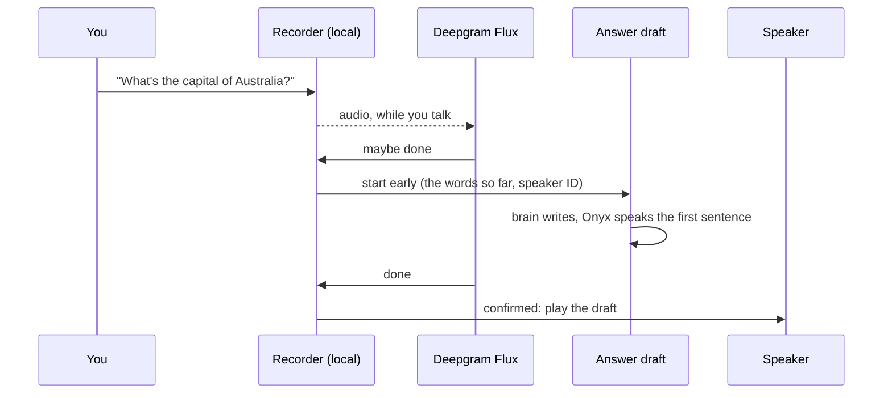

# Response time

How long TARS takes to answer, from the moment you stop talking to its first sound, where that time goes, and what
was tried to shorten it. Measured with `tools/latency_bench.py` (below).

## Where the time goes

Median over 8 spoken questions, three runs, on the development Mac:

| Stage | Time | What happens |
|---|---|---|
| Waiting to be sure you're done | ~0.6 s (0.2-1.7 s) | Deepgram's Flux decides, from your words as well as the pause |
| Speech to text | ~0 s | Flux sends the words with its decision |
| The brain's first sentence | ~0.8 s | OpenAI, streamed |
| The voice's first audio | ~0.9 s | OpenAI's Onyx, a sentence at a time |
| **From you stopping to TARS's first sound** | **~2.0-2.6 s** | the answer is prepared during the wait, so these overlap |

It was 3.5 s before any of this work (the recording uploaded and transcribed only after a 0.5 s wait), then about
2.5-3 s with Deepgram's streamed Nova-3 and a local end of turn (Silero VAD and Smart Turn), which also cut off
sentences with a pause in them; see [going all in on Deepgram](#going-all-in-on-deepgram-measured-2026-09-27).

## How the stages overlap



**Start early, speak late.** When Flux thinks you may be done, TARS prepares the answer in the background while
the recording goes on (`draft.py`). If you carry on talking, the draft is thrown away and the brain forgets it (without
waiting for it: a draft stuck in a web search can't hold up the next one); it's
only played, logged, and allowed to send anything to the web page once your turn is confirmed over. So the waiting
rule decides only *when TARS speaks*, never what it heard: a cut-off can't come from answering early.

**The end of your turn** (`stt.FluxSession`, `recorder.py`): [Flux](https://deepgram.com/learn/introducing-flux-conversational-speech-recognition)
hears your words as well as the pause, so "and the..." isn't taken for the end of a sentence. Silero VAD (local)
still hears when you start talking. If Flux fails, the local rules take over for that turn: after 0.8 s of silence,
[Smart Turn](https://github.com/pipecat-ai/smart-turn) (a small local model that listens to how your last words
sounded) may extend the wait to 1.6 s, and a draft starts a quarter second into a pause. `[stt] provider =
"deepgram"` makes the local rules the only ones again.

**Failures.** The voice gives up after 4 s without audio instead of the client's 15 s, and TARS says so in its own
voice, from lines synthesized at startup ("I lost that one somewhere between here and the server. Ask me again.";
plainer below 50% humor). If Deepgram fails, OpenAI transcribes the same recording.

## Settings

| Setting | In `config.toml` | What it does |
|---|---|---|
| `[stt] provider` | `"deepgram"` | `openai` sends the finished recording instead (slower, one key fewer) |
| `[recorder] end_silence_s` | `0.8` | silence that ends your turn |
| `[recorder] max_pause_s` | `1.6` | how long a pause may be when you sounded mid-thought |
| `[recorder] end_of_turn` | `"smart"` | `silence` turns the model off |
| `[recorder] answer_early_s` | `0.25` | when the answer starts being prepared; `0` waits for the end |
| `[recorder] vad_threshold` | `0.5` | how sure the speech detector must be |
| `[llm] humor` | `75` | the persona's humor setting, and which error lines TARS uses |

## Measuring

```bash
uv run python tools/latency_bench.py
uv run python tools/latency_bench.py --set recorder.end_silence_s=0.6 --set stt.provider=openai
uv run python tools/latency_bench.py --set stt.provider=flux --set tts.provider=deepgram --set tts.model=flux-cliff-en
uv run python tools/turn_bench.py      # cut-offs: today's end of turn against Flux, on your own sentences
```

The benchmark speaks 8 questions once (Deepgram's Aura voice, cached in `voice_data/bench/`), plays them to the
assistant at real-time pace over real room tone taken from your recordings, and measures from where the voice ends in
the audio to when the first reply sound would play. It uses the real services, so it costs a few cents a run, and
the numbers move by a few tenths between runs with the network and the model; compare medians over several runs.
Every turn also prints its own stage timings in the assistant's log.

## Going all in on Deepgram (measured 2026-09-27)

Deepgram's voices, and its Flux model deciding when you've finished, both behind settings (`[tts] provider =
"deepgram"`, `[stt] provider = "flux"`). Same benchmark, same night, median over 16 turns per setup:

| Setup | From you stopping to TARS's first sound | Slowest turn |
|---|---|---|
| Before: Nova-3, Silero + Smart Turn, Onyx | 2.63-3.02 s | 5.58 s |
| Deepgram voice (Flux Cliff or Aura-2 Zeus) | 1.99-2.05 s | 2.44 s |
| Flux turn-taking, Onyx (the default since 2026-09-28) | 2.03-2.62 s (3 runs) | 4.72 s |
| Flux turn-taking, Deepgram voice | 1.59-2.47 s (6 runs, most under 1.95 s) | 3.37 s |

**The voice.** A warm connection to Deepgram starts speaking in about 0.27 s; opening one takes about 0.7 s from
here, so `tts.DeepgramSpeech` keeps two open from the wake word (idle ones stay usable for minutes). Onyx's first
audio averaged about 1.0 s, with stalls past 2 s. Deepgram's voices take no delivery instructions; Flux TTS has an
expressivity setting instead. Which voice sounds most like TARS is a listening test, not a benchmark.

**The end of the turn** (`tools/turn_bench.py`): the owner's 25 recorded sentences, whole, and with a pause spliced
in after an unfinished word ("and", "the", "to"...), 0.5, 0.8 or 1.2 s long.

| | Before (Silero + Smart Turn) | Flux |
|---|---|---|
| Turn over after a whole sentence | 0.88 s | 1.05 s median, 90% within 1.29 s |
| Cut-offs in a 0.5 / 0.8 / 1.2 s pause | 0 / 0 / **18 of 18** | 0 / 1 / 1 of 18 |

The local setup cut off every 1.2 s pause because Smart Turn called them finished: checked after 0.8 s of silence, it
scored 17 of these 18 unfinished sentences as done (after 0.2 s, 13 of 18), so it almost never extends the wait.
Flux hears the words too ("...and the" isn't a sentence). Spliced pauses aren't real hesitations (no "um", no
stretched last word), which may flatter Flux; real use will tell. Flux's early "maybe done" (where a draft starts)
came 0.65 s after the end of a sentence, and was taken back in 20 of the 54 paused ones: a draft thrown away, about
one extra brain call in three. Flux ends a turn Flux's way in the benchmark as in the assistant (the same settings,
the same 2.5 s backstop, judged by where in the audio it decided). If Flux fails, the recorder's own rules take
over for the rest of the turn and OpenAI transcribes the recording; if the recording ends before Flux calls it,
Flux sends the words it has within a quarter second.

## Tried and dropped

| Tried | Result | Kept? |
|---|---|---|
| Faster voices: ElevenLabs Flash, Deepgram Aura, Cartesia Sonic | 0.2–0.45 s to first audio against Onyx's ~1 s; total 1.6–1.9 s | no: Onyx sounds best, and it's the only one that takes delivery instructions |
| A backup voice when Onyx stalls | worked, but the voice changes mid-reply | no: a 4 s timeout and a spoken error line instead |
| Ending the turn after 0.24 s when Smart Turn says "finished" | 1.6 s total, but it cut sentences in half (it scores some mid-sentence pauses as finished) | no: the model may only extend the wait |
| Speaking the reply's first clause before its sentence ends | no measurable gain (2.99 s without, 3.28 s with; most replies are one sentence) | no |
| webrtcvad, with rules for its false alarms (tonal hums, lone noise blocks) | brittle: every rule fixed one case and broke another | replaced by Silero VAD |
| Warming the voice's connection | ~0.15 s per fresh connection | only the brain's (shared with the voice) is warmed |
| OpenAI's Realtime API (speech in, speech out) | reported around 1 s, but it ties the brain to OpenAI's realtime models | not tried: the brain stays swappable |
