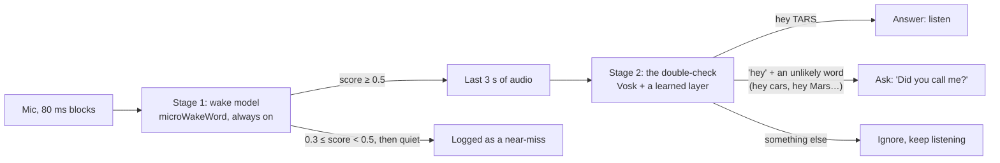

# Hearing "hey TARS"

"Hey TARS" is short and rhymes with everyday phrases ("hey cars", "hey stars", "hey guitars"), it has to be heard
locally on a Raspberry Pi on every 80 ms of audio, and it must not wake on the TV. TARS answers it with two stages: a
lenient microWakeWord streaming model, then a Vosk double-check with a small learned layer that turns down the
lookalikes. Both were trained without any household recordings, on synthetic speech from more than 2,000 voices, 342
real speakers reached through voice conversion and real lookalike words cut from audiobooks, and evaluated end to
end on voices and recordings they never trained on, in 8 listening conditions. The shipped pair answers 97% of
held-out synthetic voices in quiet, 93% of the owner's takes in quiet (a voice it never heard) and 64% of 486 cloned
real speakers across all 8 conditions, lets 0–5% of lookalikes through, and gave one false answer in an hour of TV
and none in an hour of audiobooks.

This page covers the problem, the design, how the models were built and measured, the results, the design decisions
and their evidence, the limitations, and the interrupt phrase "TARS stop" under development. The commands are in
[`training/`](../training/README.md).

## The problem

- **The phrase invites mistakes.** "Hey TARS" is two short syllables, and many common phrases differ by one sound. The
  owner says it with a soft *t*, which a recognizer often hears as "hey darts".
- **It runs all the time, on the Pi.** Every 80 ms block of audio goes through the detector, so it must cost almost
  nothing, and nothing leaves the house to decide whether TARS was called.
- **Two errors matter.** Not answering when called, and answering the TV or a conversation. Both are measured below.
- **It must work for a household it has never heard.** The committed models are what a new household starts with,
  so they can't be trained on that household's voices. They improve later from its real use
  ([self-learning](self-learning.md)).

## Design: two stages

**Stage 1** is a [microWakeWord](https://github.com/kahrendt/microWakeWord) streaming model
(`models/generic/hey_tars.tflite`, 69 KB). It sees every 80 ms block and costs almost nothing, so it can be lenient:
the threshold is 0.5, low on purpose, because stage 2 filters what gets through. A score that comes close (60% of
the threshold) and then falls away is logged as a near-miss, which is often a real "hey TARS" said too softly.

**Stage 2** runs only when stage 1 fires. [Vosk](https://alphacephei.com/vosk/) (small English model, 0.15) listens
to the last 3 seconds with a grammar limited to "hey tars", "hey darts" (the soft *t*), 19 lookalikes ("hey cars",
"hey stars", "hey guitars", a bare "hey"…) and `[unk]`. A small logistic regression
(`models/generic/hey_tars_check.json`, 21 weights) turns how Vosk ranked those phrases into one confidence. Then:

- **answer** when it's confident the phrase was "hey TARS";
- **ask** "Did you call me?" when it heard "hey" plus a word nobody says to a speaker ("hey cars"), so a mumbled
  "hey TARS" still gets a chance (a "no", or silence, is logged as not for TARS);
- **ignore** anything else, including plausible phrases like "hey there" or "hey Jarvis".

Code: `wake.py` (stage 1), `verify.py` (stage 2 and the answer/ask/ignore decision). Settings: `[wake]` in
`config.toml`.

### Two setups

| | Generic (default, committed) | Personal (local only) |
|---|---|---|
| Stage 1 | `models/generic/hey_tars.tflite`: synthetic voices and real lookalike words, never a household member | adds half of the owner's recordings |
| Stage 2 layer | synthetic, converted and accented voices | adds the owner's training half |
| Check window | 3.0 s | 2.5 s |
| Where | the repo; self-learning TARS starts from it | `models/personal/`, gitignored |

The generic setup is the default because self-learning TARS starts from it: it has to work acceptably for a
household it has never heard, then improve from that household's real use. The personal setup shows how far one
person's recordings take it.

## How the models were built

Training needs about 130 GB of audio, its own Python environments and a day or two of CPU, so it runs on a bigger
machine than the Pi. The pipeline has five parts: speech to learn from, background sound, the stage 1 recipe, the
stage 2 layer, and an evaluation that every candidate pair goes through before it's used.
[`training/README.md`](../training/README.md) has the run order, commands and times.

### Data strategy

No household recordings exist when TARS is first installed, and the generic setup must never use one. So the
training speech is synthetic, made in bulk from many text-to-speech engines and voices, and widened toward real
people in two ways: voice conversion into real speakers, and real lookalike words cut from audiobooks. Variety is the
point: many speakers, deliveries, pitches and speeds for "hey TARS", and the same for the lookalikes it must turn
down.

| Source | What | Used for |
|---|---|---|
| Piper, LibriTTS-R voices | 50k "hey TARS" and 50k lookalike clips, ~900 speakers | stage 1 |
| Piper, ~1,100 other voices | VCTK, L2-ARCTIC (accented English), ARCTIC, ARU, SEMAINE, LibriTTS-high and single voices | both |
| Kokoro | 28 voices and blends of pairs | both |
| OpenAI TTS | 8 voices, each in 164 deliveries (speaking styles, spellings, moods, pace, distance) plus 38 lookalikes; 3 more voices held out for testing | both |
| Pitch and tempo variants | ±4 semitones, 0.8–1.25× speed over the synthetic clips | stage 1 |
| Accented Piper voices | 92 non-English voices in 45 languages, with native spellings ("хэй тарс") | stage 2 |
| Voice conversion | the synthetic clips turned into real people's voices with kNN-VC: 342 speakers, 249 from LibriSpeech and 93 from VCTK (many English accents) with usable conversions | stage 2 |
| Real lookalikes | real people saying "stars", "cars", "guards"… cut from LibriSpeech train-clean-100 with a forced aligner (MMS) | both |
| microWakeWord negatives | the standard negative sets (speech, music, noise) | stage 1 |
| Cloned Common Voice speakers | 486 real speakers, cloned zero-shot (see [the evaluation](#how-it-was-measured)) | evaluation only |

"TARS" is spelled `tarss` for espeak-based voices so it's said with an S, the way the household says it. Which
source goes into which stage was decided by measurement; see [what stage 1 learns from](#what-stage-1-learns-from)
and [what the double-check needs](#what-the-double-check-needs).

### Background sound and rooms

Training mixes clips into MUSAN music, speech and noise, synthesized babble and TV-in-a-room, AudioSet, FMA, and
simulated and real room responses (RIRS_NOISES, MIT). The test noise is a separate set no model trains on
([below](#how-it-was-measured)).

### Stage 1: the wake model

microWakeWord, trained with this recipe: 20k steps, learning rate 0.001, negative class weight 20, SpecAugment,
batch 128, 1.5 s clips, and augmentation with background sound from −5 to 15 dB and room echo. The checkpoint kept
is the one with the best average recall among those under 0.5 false accepts per hour of ambient audio. The generic
model is that recipe on all the synthetic clips, unfiltered, plus the real lookalikes at double weight. Features are
stored as uint16, which is lossless (the microfrontend's outputs are integers times 0.0390625).

The recipe was arrived at by training variants and scoring each on held-out data: a longer two-phase schedule, twice the
steps, filtered positives, accented voices and voice conversions were each tried in stage 1 and left out on the
evidence in [design decisions](#design-decisions).

### Stage 2: the learned layer

For each clip, the features are how Vosk ranks each phrase in its grammar relative to its top guess. A logistic
regression learns "is it hey TARS?" from Kokoro, Piper-voice and OpenAI clips, the LibriSpeech and VCTK voice
conversions, the accented Piper clips and the real lookalikes, sampled down to 6,000 wake phrases and 7,000
lookalikes, each put through one random training condition (noise, room). It uses the assistant's own feature code
(`verify.TunedCheck`), so training and runtime can't drift apart. The generic layer uses no household recordings;
the personal one adds the owner's training half. Stage 2 is deterministic: rerunning it on the same data, in the
environment `training/setup/eval_env.sh` pins, gives the same layer.

### How it was measured

Candidates are tested the way the assistant runs: audio streams through stage 1 in 80 ms blocks, each test clip
gets 2 s of faint noise before and after (as in a live stream; stage 1 needs context), and a clip counts as answered
only when stage 1 fires and stage 2 says yes. Each clip is played in 8 conditions: quiet; TV
at 5, 10 and 15 dB; babble at 5, 10 and 15 dB; and TV at 10 dB across a real recorded room. The noise and rooms are
test-only (LibriSpeech test-clean babble, FMA, ESC-50, real room recordings, an hour of TV). Test audio never
overlaps training audio.

Each test set answers a different question, and a candidate is judged on all of them:

| Test set | Question it answers | Contents | Scored |
|---|---|---|---|
| Held-out synthetic voices | Regression: does a change still work on the kind of voice it was trained on? | 3 of the 11 OpenAI voices (coral, sage, verse), 90 wake phrases and 42 lookalikes | end to end |
| Speaker panel | Does stage 1 generalize to many real speakers? | 342 LibriSpeech and VCTK speakers, voice-converted with kNN-VC to say "hey TARS" and lookalikes | stage 1 alone: the learned layer trains on those same converted voices |
| Cloned Common Voice speakers | Does the pair generalize to real speakers and accents it never heard? | 486 speakers from the Irish, Scottish, Malaysian and US South English subsets; one wake phrase and one lookalike per speaker | end to end, only for candidates that never trained on them |
| The owner's recordings | Does it work for a real voice, in a real room, on a real mic? | 5 variations (normal, far, quick, quiet, TV on) × 6 takes, plus 42 lookalikes | end to end |
| False answers | Does it stay quiet when nobody calls it? | an hour of TV and an hour of audiobooks, through both stages; any answer counts | end to end |

The held-out synthetic voices measure regressions, not real people: they're the same engine as part of the training
data. The owner's takes 0–2 of each variation may train the personal setup; takes 3–5 never do. The generic setup
never trains on any, so its test uses all 30.

The cloned speakers come from [Mozilla Common Voice](https://commonvoice.mozilla.org/) (CC0), downloaded through the
Mozilla Data Collective. For each speaker, a 5–12 s reference of their own speech lets Chatterbox Turbo (MIT) clone
the voice zero-shot and say six "hey TARS" variants (spelling and punctuation vary the delivery) and six lookalikes
("hey stars", "hey cars", "hey Tara", "hey bars", "hey guards", "hey tarot"): 2,916 wake phrases and 2,916
lookalikes from the four subsets, a few hours on a Colab T4 GPU. The raw clips are used for testing, unfiltered.
Chatterbox's Perth watermark is kept, and the dataset terms forbid trying to identify speakers or rehosting the
audio, so the clips are never redistributed.

Benchmarks: `tools/wakeword_bench.py` (stage 1 alone), `tools/verifier_bench.py` (stage 2 alone),
`training/eval/pipeline.py` (both, end to end, on any of the sets) and `training/eval/candidates.py` (several stage-1
candidates on the speaker panel, ranked at equal strictness).

### Comparing and selecting candidates

Stage 1 training is non-deterministic: microWakeWord's augmentation is unseeded, and candidates trained on the same
data and recipe differ substantially. Across 30 retrains, both stages together answered between 19% and 73% of the
owner's training-half takes, averaged over the 8 conditions (the shipped pair: 64%). On the speaker panel, the best
stage 1 answered at least 80% of the wake phrases of 68% of its speakers, against 61% for the shipped one, at the
same strictness. That batch measured the spread rather than producing a release: its training data included voices
without a licence for redistributing a model trained on them, so none of its candidates could ship.

So the pipeline treats training as candidate generation, not as producing the model. Candidates are trained, each
is scored end to end on the held-out sets above, and one is installed only if it beats the pair in use. A
difference from a single run that is smaller than this spread is not treated as evidence; a recipe question is
settled with several candidates per option. For example, training stage 1 with the cloned voices (five candidates
with them, five without, same recipe) made no measurable difference, so they are used only as an evaluation set. That
experiment used an opt-in data source that wasn't kept, so it can't be rerun from the repo.

### Closing the loop: the household retrain

Once TARS runs in a home, every wake and near-miss is saved with its audio and labeled, mostly automatically
([self-learning](self-learning.md)). `training.household` copies those labeled wakes to a bigger machine, holds every
fifth out for testing, and trains one new candidate pair: the generic recipe plus the household's clips. It then
tests that candidate and the pair in use side by side on the household's held-out wakes, the held-out voices and
lookalikes in the 8 conditions, and false answers per hour on TV and audiobooks. It installs the candidate only if
it answers more of the household's real wakes (or lets fewer through that weren't for TARS) and is no worse on
anything else. Each run trains one candidate; running it again gives another, compared the same way
([commands](../training/README.md#training-a-households-own-models)).

## Results

The shipped pairs, measured as [above](#how-it-was-measured).

**Generic setup** (trained on no household voices)

| Test | Answered |
|---|---|
| Held-out synthetic voices, quiet | 97% |
| Same voices, TV or babble at 10–15 dB | 87–97% |
| The owner, whom it never heard, quiet (30 takes) | 93% |
| Cloned Common Voice speakers, all 8 conditions | 64% |
| Lookalikes let through: held-out voices | 0–5% |
| Lookalikes let through: cloned Common Voice speakers | 0.5% |
| False answers in an hour of TV | 1 (Vosk heard "hey darts") |
| False answers in an hour of audiobooks | 0 |

**Personal setup**, the owner's 15 held-out takes, 2.5 s window

| Condition | Answered |
|---|---|
| Quiet | 93% |
| TV at 10–15 dB | 93% |
| Babble at 15 dB | 87% |
| Across the room with the TV on | 73% |
| TV at 5 dB | 67% |
| Babble at 5–10 dB | 47% |
| The owner's own lookalikes let through | 7% |
| False answers per hour (TV, audiobooks) | 0 |

**Cost** on the development Mac (Apple Silicon): stage 1 takes 0.09 ms per 80 ms block; the check takes about 21 ms
and only runs on a wake. Even a few times slower on a Raspberry Pi 5, that's comfortable.

## Design decisions

Each decision below names the constraint it answered, the options that were evaluated, the evidence, and the
trade-off accepted. Most options were trained or built and scored on held-out data. Two weren't scored that way:
open transcription in the double-check was ruled out from what it wrote, and voice conversion in stage 1 gave mixed
results rather than one number.

### Why two stages

**Constraint:** a detector that runs on every 80 ms block must be tiny, and a tiny model can't reliably tell "hey
TARS" from "hey cars"; and answering the TV has to stay rare.

| Option | Evidence | Decision |
|---|---|---|
| A lenient detector, then a check on each wake | stage 1 alone fires about 6 times an hour on TV and 3 on audiobooks; with the check, 1 and 0 | used |

A single detector made strict on its own wasn't trained as an option. Getting stage 1 alone from 6 fires an hour to
1 would take a much stricter detector, and the one attempt to make stage 1 stricter, training it only on positives
Vosk hears clearly, cost the owner's quiet takes 93% → 77% ([what stage 1 learns from](#what-stage-1-learns-from)).
That suggests, without proving it, that one strict detector would miss more real wakes than the pair.

**Trade-off:** a check of about 21 ms after each wake, and a second model to train and keep in step with the first.
In return, stage 1 can be tuned for recall (threshold 0.5) and stage 2 for precision.

### Choosing the detector

**Constraint:** streaming, small enough for the Pi, and good on a voice it never trained on.

| Option | Evidence | Decision |
|---|---|---|
| openWakeWord, custom "hey TARS" model (50k clips) | 27% of the owner's takes | not used |
| microWakeWord | the shipped pair answers 93% of the owner's takes in quiet; 69 KB, 0.09 ms per block | used |

**Trade-off:** microWakeWord's training needs its own environment and 20 GB of negative sets, and its augmentation
is unseeded, so runs differ; the [candidate selection](#comparing-and-selecting-candidates) absorbs that.

### What stage 1 learns from

**Constraint:** stage 1 must stay lenient and generalize to unheard voices; its mistakes are cheap because stage 2
follows. So it is given variety, even at the cost of label noise.

| Option | Evidence | Decision |
|---|---|---|
| Only positives Vosk hears as "hey TARS" (`data/clean.py`) | owner in quiet 93% → 77%: stage 1 learned one crisp "TARS" | not for stage 1; the filtered lists feed voice conversion |
| Accented Piper voices | other voices in quiet 96% → 72% | stage 2 only, where they help a little |
| Voice conversions into real speakers | mixed results | stage 2 only |
| Pitch and tempo variants | Vosk hears 72% of them as something else ("hey cars", "haters") | stage 1 only |
| Cloned Common Voice speakers | 5 candidates with, 5 without, same recipe: no measurable difference (an opt-in source, not kept) | evaluation only |
| A longer schedule: 60k steps, a second phase with negative weight 50 | worse everywhere (owner 80%) | 20k steps; its augmentation is kept |
| Twice the training steps | overfit to the owner's voice | 20k steps |

**Trade-off:** stage 1 lets through more lookalikes than a strict model would, by design; stage 2 turns them down.
The cloned voices add nothing to training, so they serve where they add the most: as speakers no candidate has
heard.

### What the double-check needs

**Constraint:** decide "hey TARS" or not from 3 s of audio, on the Pi, in tens of milliseconds, including for a soft
*t*. Stage 2 needs clean labels, so it learns from the accented and converted voices that stage 1 doesn't use, and
not from the pitch and tempo variants.

| Option | Evidence | Decision |
|---|---|---|
| Open transcription (Whisper, Parakeet, Moonshine) | "TARS" came out as "Hate Dars", "Taurus" | not used |
| Forced-choice scoring with those recognizers | 70–77% | not used |
| A keyword spotter (sherpa-onnx) | 27–43% | not used |
| Vosk with a grammar of the phrase and its lookalikes, plus a learned layer | the [results](#results) above | used |
| Adding Moonshine-tiny forced-choice features to the layer | babble at 5 dB 33% → 60%, but 550 MB more of PyTorch and ~55 ms per check | not used |

**Trade-off:** a closed grammar can only say which listed phrase it heard, which is exactly the question; the
Moonshine features would help in loud babble, but at a size and per-check time judged too high for the Pi.

**Check window.** The generic stage 1 can fire up to a second after the phrase ends, so a 2 s window often cut off the
"hey": with a generic stage 1 that was also trained on voice conversions, other voices were answered 81% of the time at
2 s and 94% at 3 s. The generic setup uses 3 s and the personal one 2.5 s. Waiting 240 ms after a wake before running
the check did slightly worse, so the check runs at once.

## Limitations

- **The owner's soft *t*** is the main reason for the generic setup's missed takes, and stage 1 never fired on most
  of them. The generic models never heard that voice; [self-learning](self-learning.md) is how they will.
- **Loud babble and distance** are the weak conditions: in the personal setup, 47% with people talking at 5–10 dB
  and 73% across the room with the TV on.
- **Most test voices are synthetic or synthesized from real speakers.** The only real wake-phrase recordings are the
  owner's, one person on one mic. The personal test half is 15 takes, so one take is about 7 points; on the generic
  setup's 30, about 3.
- **The speaker panel's timbres may be partly familiar.** Stage 1's Piper LibriTTS-R voices come from LibriTTS-R,
  which is built from LibriSpeech, so the panel's LibriSpeech speakers may overlap the speakers behind those training
  voices. The panel measures generalization to new deliveries of partly familiar timbres, not only to new people.
- **Selection and reporting.** Stage 1 candidates are ranked on the speaker panel and the owner's training half, and
  reported on sets not used for picking. The household retrain decides and reports on the same small held-out set,
  with no margin, so a one-take difference can decide an install.
- **Run-to-run spread.** Most recipe decisions above rest on one candidate per option, while retrains of the same
  recipe differ widely. The large differences (openWakeWord's 27% of the owner's takes, 96% against 72%, 93% against
  77%) were the basis for the decisions; the small ones would need several candidates per option to confirm.
- **Cost on the Pi** isn't measured yet; the numbers above are from the development Mac.

## Next steps

Offline tuning has reached diminishing returns: the last experiments each moved one or two takes, which is within
the spread between retrains. The next gains come from real use. Every wake and near-miss is saved with its audio and
labeled, and both stages are retrained together on the household's own clips, especially the near-misses that were a
missed "hey TARS", then tested end to end against the pair in use before anything is installed
([the household retrain](#closing-the-loop-the-household-retrain)). The interrupt phrase is the other open piece of
work, below.

## "TARS stop"

"TARS stop" is the interrupt phrase under development: said while TARS talks, it should cut the answer off
([roadmap](roadmap.md), step 2). It isn't in use yet.

**Why "stop" is a negative.** A "TARS stop" model trained without "stop" among its negatives learned the word
"stop" rather than the phrase. So the current model treats "stop" on its own and in sentences
("please stop", "I can't stop laughing", "timer stopped") as negatives, and doesn't use the real lookalikes, which
are cut for "hey TARS" only. The double-check got a "tars stop" grammar: it accepts "tars stop", "tar stop" (how it's
heard said quickly) and "darts stop", and turns down "stop" on its own or after another word, and "hey tars". It's
trained with `stage1/train.py generic --phrase tars_stop`, about 3 hours on the development Mac with every step.

**Results.** The check alone accepts 85 of the 90 held-out "TARS stop" clips. Both stages, end to end on the
held-out OpenAI voices (`eval/pipeline.py --phrase tars_stop`):

| Threshold, check window | Quiet | TV 15 dB | Babble 15 dB | Far room + TV | TV 5 dB | Babble 5 dB | False answers per hour (TV, audiobooks) |
|---|---|---|---|---|---|---|---|
| **0.4, 3 s** | **83%** | **86%** | **81%** | 60% | 53% | 37% | **0, 0** |
| 0.4, 2 s | 80% | 82% | 79% | 60% | 51% | 39% | 0, 0 |
| 0.5, 2 s | 76% | 77% | 71% | 51% | 48% | 30% | 0, 0 |

At a threshold of 0.3, stage 1 fires on the noise before the phrase and catches nothing. The pair never answered
"hey TARS", and of the lookalikes only "tar stop", "tarts stop" and "guitars stop", which sound the same; "stop",
"bus stop" and "stars stop" are turned down. As for "hey TARS", stage 1 fires after the phrase ends, so the check
needs 3 s; waiting 0.4 s more before the check halved what it caught. Weighting the lookalikes half as much in
stage 1 made it worse in noise (18% at TV 5 dB). It's safe, but it misses more than "hey TARS", most in loud noise.

**Before it's used**, it needs a learned layer in the check, as "hey TARS" has; the owner's own takes; and a test
while TARS is speaking, with echo cancellation, which is where it will be used.
