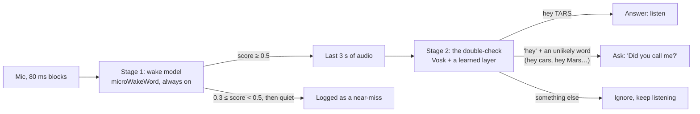

# Hearing "hey TARS"

How TARS decides it was called: the two stages that run on every block of audio, how their models were trained,
how they were measured, how well they do, and what was tried and dropped on the way. The scripts that made the
models are in [`training/`](../training/README.md).

## Two stages

**Stage 1** is a [microWakeWord](https://github.com/kahrendt/microWakeWord) streaming model
(`models/generic/hey_tars.tflite`, 69 KB). It sees every 80 ms block and costs almost nothing, so it can be lenient:
the threshold is 0.5, low on purpose, because stage 2 filters what gets through. A score that comes close (60% of
the threshold) and then falls away is logged as a near-miss, which is often a real "hey TARS" said too softly.

**Stage 2** runs only when stage 1 fires. [Vosk](https://alphacephei.com/vosk/) (small English model, 0.15) listens
to the last 3 seconds with a grammar limited to "hey tars", "hey darts" (how a soft *t* often comes out), 19
lookalikes ("hey cars", "hey stars", "hey guitars", a bare "hey"…) and `[unk]`. A small logistic regression
(`models/generic/hey_tars_check.json`, 21 weights) turns how Vosk ranked those phrases into one confidence. Then:

- **answer** when it's confident the phrase was "hey TARS";
- **ask** "Did you call me?" when it heard "hey" plus a word nobody says to a speaker ("hey cars"), so a mumbled
  "hey TARS" still gets a chance (a "no", or silence, is logged as not for TARS);
- **ignore** anything else, including plausible phrases like "hey there" or "hey Jarvis".

The check window is 3 seconds because the generic stage 1 can fire up to a second after the phrase ends; with 2
seconds the "hey" was often cut off (other voices, measured with an earlier model: 81% at 2 s, 94% at 3 s). Code: `wake.py` (stage 1),
`verify.py` (stage 2 and the answer/ask/ignore decision). Settings: `[wake]` in `config.toml`.

## Two setups

| | Generic (default, committed) | Personal (local only) |
|---|---|---|
| Stage 1 | `models/generic/hey_tars.tflite`: synthetic and converted voices, never a household member | adds half of the owner's recordings |
| Stage 2 layer | synthetic, converted and accented voices | adds the owner's training half |
| Check window | 3.0 s | 2.5 s |
| Where | the repo; self-learning TARS starts from it | `models/personal/`, gitignored |

The generic setup is the default because self-learning TARS starts from it: it has to work acceptably for a
household it has never heard, then improve from that household's real use (see [self-learning](self-learning.md)).

## Performance

Measured end to end, the way the assistant runs: audio streams through stage 1 in 80 ms blocks, and a clip only
counts as answered when stage 1 fires and stage 2 says yes. Test audio never overlaps training audio (see
[how it was measured](#how-it-was-measured)).

**Generic setup**

| Test | Recall |
|---|---|
| Held-out synthetic voices (3 OpenAI voices never trained on), quiet | 97% |
| Same voices, TV or people talking at 10–15 dB | 87–97% |
| The owner, whom it never heard, quiet (30 takes) | 93% |
| Lookalike phrases let through ("hey cars", "hey stars"…) | 0–5% |
| False answers per hour: an hour of TV, an hour of audiobooks | 1 on the TV hour (Vosk heard "hey darts"), 0 on audiobooks; stage 1 alone fires about 6 and 3 times an hour |

**Personal setup**, the owner's 15 held-out takes (one take ≈ 7 points), 2.5 s window

| Condition | Recall |
|---|---|
| Quiet | 93% |
| TV at 10–15 dB | 93% |
| People talking at 15 dB | 87% |
| Across the room with the TV on | 73% |
| TV at 5 dB | 67% |
| People talking at 5–10 dB | 47% |
| The owner's own lookalikes let through | 7% |
| False answers per hour (TV, audiobooks) | 0 |

The weak spots are loud babble, distance, and in the generic setup, voices unlike any training voice: the owner's
soft *t* is the main reason for the generic setup's missed takes, most of which stage 1 never fired on. That gap is
what [self-learning](self-learning.md) is for.

Cost on the development Mac (Apple Silicon): stage 1 takes 0.09 ms per 80 ms block; the check takes about 16 ms and
only runs on a wake. Even a few times slower on a Raspberry Pi 5 that's comfortable (not measured on the Pi yet).

## How the models were trained

The training needs about 130 GB of audio, its own Python environments and a day or two of CPU, so it runs outside
the assistant. [`training/README.md`](../training/README.md) has the run order, commands and times; rerunning
stage 2 on the same data, in the environment `training/setup/eval_env.sh` pins, gives the same layer.

### 1. Speech to learn from

| Source | What | Used for |
|---|---|---|
| Piper, LibriTTS-R voices | 50k "hey TARS" and 50k lookalike clips, ~900 speakers | stage 1 |
| Piper, ~1,100 other voices | VCTK, L2-ARCTIC (accented English), ARCTIC, ARU, SEMAINE, LibriTTS-high and single voices | both |
| Kokoro | 28 voices and blends of pairs | both |
| OpenAI TTS | 8 voices, each in 164 deliveries (speaking styles, spellings, moods, pace, distance) plus 38 lookalikes; 3 more voices held out for testing | both |
| Pitch and tempo variants | ±4 semitones, 0.8–1.25× speed over the synthetic clips | stage 1 |
| Accented Piper voices | 92 non-English voices in 45 languages, with native spellings ("хэй тарс") | stage 2 |
| Voice conversion | the synthetic clips turned into real people's voices with kNN-VC: 251 LibriSpeech speakers and VCTK's 110 (many English accents) | stage 2 |
| Real lookalikes | real people saying "stars", "cars", "guards"… cut from LibriSpeech train-clean-100 with a forced aligner (MMS) | both |
| microWakeWord negatives | the standard negative sets (speech, music, noise) | stage 1 |

"TARS" is spelled `tarss` for espeak-based voices so it's said with an S, the way the household says it.

### 2. Background sound

Training mixes clips into MUSAN music, speech and noise, synthesized babble and TV-in-a-room, AudioSet, FMA, and
simulated and real room responses (RIRS_NOISES, MIT). None of the test-only sounds below are ever used.

### 3. Stage 1

microWakeWord, with the recipe the experiments settled on: 20k steps, learning rate 0.001, negative weight 20, and
augmentation with background sound from −5 to 15 dB and room echo. The generic model is that recipe on
all the synthetic clips (uncleaned) plus the real lookalikes at double weight. Features are stored as uint16, which
is lossless (the microfrontend's outputs are integers times 0.0390625).

### 4. Stage 2's learned layer

For each clip, the features are how Vosk ranks each phrase in its grammar relative to its top guess. A logistic
regression learns "is it hey TARS?" from Kokoro, Piper-voice and OpenAI clips, the LibriSpeech and VCTK voice
conversions, the accented Piper clips and the real lookalikes, sampled down to 6,000 wake phrases and 7,000
lookalikes, each put through one random training condition (noise, room). It uses the assistant's own feature code
(`verify.TunedCheck`), so training and runtime can't drift apart. The generic layer uses no household recordings;
the personal one adds the owner's training half.

## How it was measured

- **Held-out voices:** 3 of the 11 OpenAI voices (coral, sage, verse), 90 wake phrases and 42 lookalikes, test only.
- **The owner's recordings:** 5 variations (normal, far, quick, quiet, TV on) × 6 takes. Takes 0–2 of each
  variation may train the personal setup; takes 3–5 never do. The generic setup never trains on any, so its test
  uses all 30.
- **Test-only noise:** LibriSpeech test-clean babble, FMA, ESC-50, real room recordings, and an hour of TV.
- **False answers:** an hour of TV and an hour of audiobooks, through both stages; any answer counts.
- **Padding:** each test clip gets 2 s of faint noise before and after, as in a live stream (stage 1 needs context).

Benchmarks: `tools/wakeword_bench.py` (stage 1 alone), `tools/verifier_bench.py` (stage 2 alone) and
`training/eval/pipeline.py` (both, end to end).

## Tried and dropped

| Tried | Result | Kept? |
|---|---|---|
| openWakeWord, custom "hey TARS" (50k clips) | 27% recall on the owner's voice; microWakeWord's first try got 97% | replaced by microWakeWord |
| A longer schedule: 60k steps, a second phase with negative weight 50 | worse everywhere (owner 80%); "TARS stop" became a "stop" detector | no (its augmentation is kept) |
| Twice the training steps | overfit to the owner's voice | no |
| Filtering synthetic positives with Vosk | stage 1 got too strict (owner quiet 93% → 77%); in two stages, stage 1 must be lenient | no, for stage 1 |
| Accented voices in stage 1 | other voices 96% → 72% | no; used in stage 2, where they help a little |
| Voice conversions in stage 1 | mixed | no; used in stage 2 |
| Whisper, Parakeet or Moonshine as the check | "TARS" became "Hate Dars", "Taurus"; forced-choice scoring 70–77%; a keyword spotter (sherpa-onnx) 27–43% | Vosk with a grammar |
| Moonshine-tiny forced-choice features in the layer | better in noise (babble 5 dB 33% → 60%), but +550 MB of PyTorch, ~55 ms per check | not wired in |
| Waiting 240 ms before the check | slightly worse | no |
| A 2 s check window | cut off the "hey" for the generic model | 3 s |
| "TARS stop" as a second wake phrase | trained alongside, never good enough | parked; second try below |

Pitch and tempo variants were a mixed case: Vosk heard 72% of them as something else ("hey cars", "haters"), so
they stay in stage 1, which needs variety, and are left out of stage 2, which needs clean labels.

## Where to go from here

Offline tuning has hit diminishing returns: every recent experiment moved one or two takes. The next gains come from
real use: every wake and near-miss is saved with its audio and labeled (mostly automatically), and both stages are
retrained together on the household's own clips, especially the near-misses that were a missed "hey TARS": an
occasional job on a bigger machine, tested end to end before it's installed. See [self-learning](self-learning.md).

## "TARS stop", second try

The interrupt, for saying while TARS talks. The first try became a detector for "stop"; the second (2026-10-09,
`stage1/train.py generic --phrase tars_stop`, about 3 hours on the development Mac with every step) adds "stop" on its
own and in sentences to what mustn't wake it, and a "tars stop" grammar to the double-check that turns those down.
Both stages, the way the assistant runs them, on the held-out OpenAI voices (`eval/pipeline.py --phrase tars_stop`):

| Threshold, check window | Quiet | TV 15 dB | Babble 15 dB | Far room + TV | TV 5 dB | Babble 5 dB | False answers per hour (TV, audiobooks) |
|---|---|---|---|---|---|---|---|
| **0.4, 3 s** | **83%** | **86%** | **81%** | 60% | 53% | 37% | **0, 0** |
| 0.4, 2 s | 80% | 82% | 79% | 60% | 51% | 39% | 0, 0 |
| 0.5, 2 s | 76% | 77% | 71% | 51% | 48% | 30% | 0, 0 |
| 0.3, 2 s | 0%: stage 1 fires on the noise before the phrase | | | | | | 0, 0 |

It never answered "hey TARS", and of the lookalikes, only "tar stop", "tarts stop" and "guitars stop" (which sound the
same); "stop", "bus stop" and "stars stop" are turned down. Stage 1 fires after the phrase ends, so the
check needs 3 s, as for "hey TARS" (waiting 0.4 s more before the check halved what it caught). Weighting the
lookalikes half as much in stage 1 made it worse in noise (TV 5 dB 18%). Safe, then, but it misses
more than "hey TARS", most in loud noise. Next: a learned layer in the check, as "hey TARS" has; the owner's own takes;
and a test while TARS is talking, with echo cancellation, which is where it will be used.

