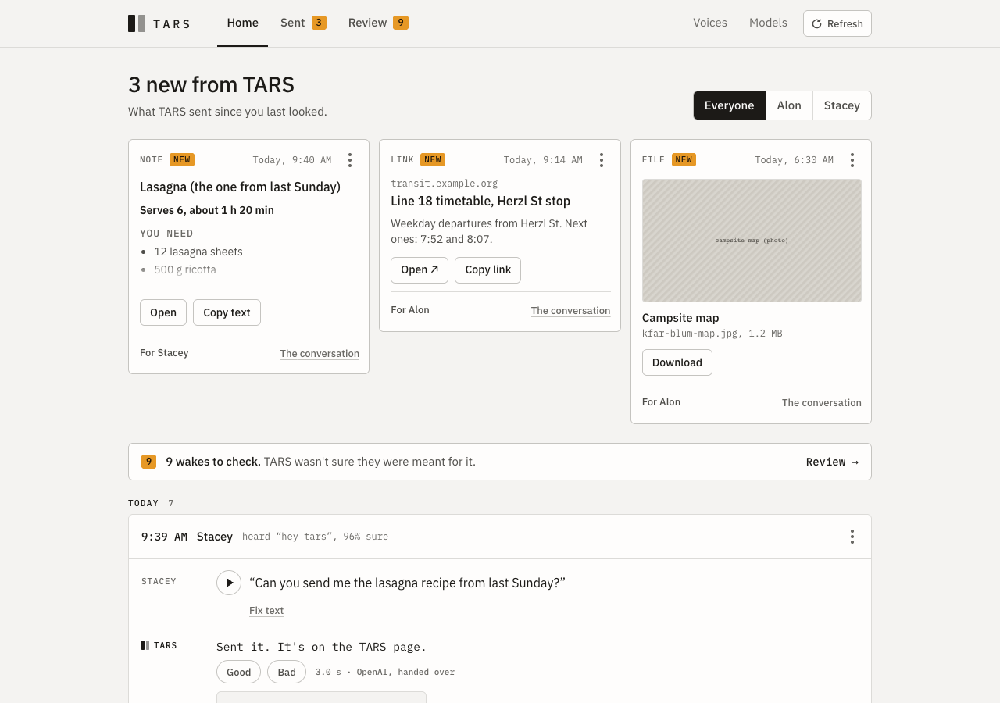
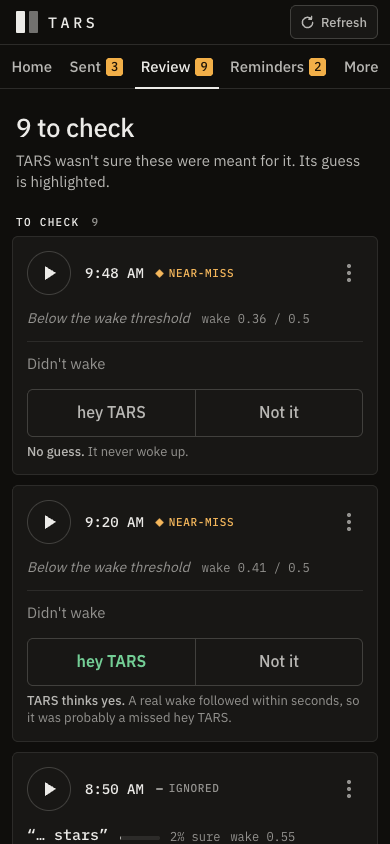

# The web UI

The household's window into TARS: what was said, what TARS sent, the wakes it wasn't sure about, and the voices it
has heard. It runs on the same machine as the assistant (`voice-assistant --web`) and is opened from a phone or
laptop on the home network. The design came from Claude Design, and screenshot tests hold the page where it is.

## Pages

| Page | What's there |
|---|---|
| **Home** | Conversations by day, newest first: who spoke (by voice), what they said (with audio), what TARS answered and sent, how long each answer took and which model wrote it, and where an answer failed. Anything TARS sent since the last Refresh sits on top. Rate an answer good or bad, fix a misheard transcript, name an unknown voice, and from a conversation's ⋯ menu: copy it, "Not meant for TARS", who was talking, delete. With two or more named people, a filter by person. |
| **Sent** | Everything TARS sent (links, notes, lists, files), New first, filterable by person or Household. The whole house sees the same list: there are no accounts. |
| **Review** | Wakes no conversation explained (a near-miss, a "Did you call me?" nobody answered, a wake followed by silence). Play what woke it; answer "hey TARS" or "Not it". TARS's own guess is highlighted. |
| **Voices** | The voices TARS has grouped: name them (TARS then greets them by name), mark one "not a person", merge two, and Regroup voices. |
| **Models** | The wake model and double-check in use and how they tested, the labeled wakes waiting to be learned from, and the version history, where "Use this" switches back. Training itself runs on a bigger machine. |

On a phone, Voices and Models sit under "More". The tab title counts what's new: "TARS (3)".

| Home | Review, on a phone |
|---|---|
|  |  |

Every page in light and dark, on desktop and phone, is in [`screenshots/`](screenshots/) (the demo data, made with
`npm run screenshots`).

## Nothing moves by itself

The page only changes when someone asks it to. There's no polling and no refresh on focus: the **Refresh** button
(and reloading the page) is the only thing that brings in new conversations and wakes, and the only thing that moves
finished items: seen things leave Home's strip and Sent's "New", answered wakes move from "To check" to
"Reviewed". Your own taps update what they touched and nothing else, so a card never jumps out from under your
finger.

In code this is one snapshot of ids taken at each Refresh (`store/load.ts`): reloads after an action only update
what the snapshot showed. Changes go to the server one at a time, in the order they were made, and a reload waits
for them, so two quick taps can't arrive out of order and a Refresh never reads what was there before your last
tap.

## The API

JSON over HTTP, all under `/api`. Errors carry a readable reason: `{"detail": "..."}`, or for a malformed body
(422) a list of problems with a `msg` each. Requests from an unknown host get 421, and changes from another site
get 403 (see [architecture](architecture.md#the-web-ui)).

| Method and path | Does |
|---|---|
| `GET /api/status` | Whether voices can be regrouped, and how many requests a voiceprint needs |
| `GET /api/conversations` | The newest 200 conversations, with their turns, sent items and the wake that started each |
| `GET /api/conversations/{id}` | One conversation |
| `DELETE /api/conversations/{id}` | It, its turns, audio and items, and the wake that started it |
| `POST /api/turns/{id}/rating` | `{"rating": "good" \| "bad" \| null}`, TARS's turns only |
| `POST /api/turns/{id}/correction` | `{"text": "..."}` what was really said; the original text clears it |
| `GET /api/audio/turn/{id}` | What someone said, as WAV |
| `GET /api/items` | Everything sent |
| `POST /api/items/{id}/seen` | Marks it seen |
| `POST /api/items/{id}/entries/{n}` | `{"done": true}` ticks a list entry |
| `GET /api/items/{id}/file` | A sent file, always as a download |
| `DELETE /api/items/{id}` | One sent item |
| `GET /api/events` | What Review needs: the newest 500 wakes and near-misses waiting for an answer and the newest 500 answered ones, with automatic labels and why (`?limit=n` for the newest n of everything) |
| `GET /api/audio/{event}/wake`, `/request` | What woke it, and the request after it, as WAV |
| `POST /api/events/{id}/label` | `{"label": "real" \| "not_real" \| null}` |
| `POST /api/events/{id}/cluster` | `{"cluster_id": n}` moves a request to a voice and pins it there |
| `DELETE /api/events/{id}` | A wake and its audio (its conversation stays) |
| `GET /api/clusters` | Voices, with sizes and their newest request clips |
| `POST /api/clusters` | `{"name": ...}` a new voice |
| `POST /api/clusters/{id}` | `{"name": ..., "kind": ...}` rename, or mark "not a person"; without `kind`, a "not a person" voice stays one |
| `POST /api/clusters/merge` | `{"keep": a, "absorb": b}` |
| `POST /api/recluster` | Regroup the requests by voice and rebuild the voiceprints |
| `GET /api/models` | The pair in use and its test results, the version history, and the labeled wakes since it was installed |
| `POST /api/models/use` | `{"version": ...}` puts a version in use (`"installed"` is config.toml's) |

## Working on it

```bash
cd webui
npm install
npm run dev        # hot reload on :5173, API proxied to :8080 (or $TARS_API)
npm test           # unit tests (Vitest): markdown, formatting, folding, the Refresh snapshot
npm run build      # typecheck, then rebuild src/voice_assistant/webui_static/ (committed)
npm run e2e        # the functional checks against a real backend (below)
npm run visual     # the screenshot tests (below); npm run visual:update accepts an intended change
npm run screenshots  # docs/screenshots/, from the current build
```

Add `?demo` to the URL for built-in sample data with no server (`?demo=empty` for none, `?demo=long` for
everything long). Real links open a tab, a person, a conversation or an item (`src/params.ts`). With `?demo`, more
parameters open any state (a dialog, a menu, a clip playing; `src/demoParams.ts`), which the checks and screenshots
use.

**Layout:** `src/store/` holds the state (`core.ts`), what views derive from it (`selectors.ts`), loading and the
Refresh snapshot (`load.ts`), tabs and filters (`nav.ts`), menus, dialogs and scrolling (`ui.ts`), and the actions
by area (`items.ts`, `conversations.ts`, `voices.ts`, `models.ts`, with the shared shapes in `actions.ts`);
`index.ts` exports them all. `src/components/` has one file per page or part. `src/demo.ts`, `src/demoParams.ts`
and `src/linkStates.ts` are only loaded with `?demo`.

## The checks

Both run headless in the installed Chrome with Playwright.

- **`npm run e2e`** (`checks/e2e.spec.ts`, a few seconds): builds a throwaway copy of the demo log with
  `tools/webui_demo.py`, serves it, and uses the page like a person would: rate and undo, fix a transcript, tick a
  list, open a note, delete, move a voice, name one with Enter, filter, check that nothing moves until Refresh, and
  switch wake models on the Models page. Every step is checked against what the server then says. The demo log's
  audio is committed (`tools/demo_audio/`, four synthetic voices made by `tools/make_demo_audio.py`), so it runs on
  any machine. A step that finds the demo missing what it needs fails rather than skipping.
- **`npm run visual`** (`checks/visual.spec.ts`, under 2 minutes): Playwright's `toHaveScreenshot()` on the states
  a link can open and after interactions (opening a menu, rating, ticking, a dialog), on desktop and phone, and the
  main pages and overlays in dark too. The page loads from the build on
  disk with a fixed clock, and each screenshot must match its baseline in `checks/screenshots/<platform>/`.

After a change that's meant to look different, run `npm run visual:update`, look at the new images in the diff,
and commit them with the change. The baselines are per platform because fonts render differently on macOS and
Linux; the committed ones are macOS (`darwin`). `npm test` runs the unit tests (Vitest) and `npm run lint` the linter
([oxlint](https://oxc.rs), with React's hooks rules); CI runs both.
